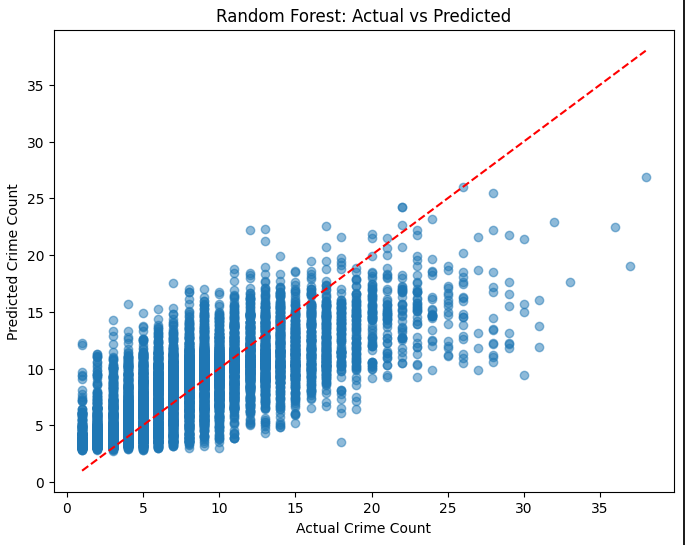
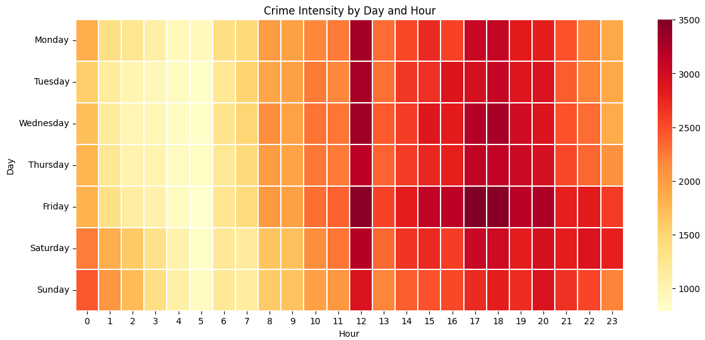

# Crime Count Prediction using Machine Learning

Predicting crime volume using historical crime records to support data-driven public safety planning, resource allocation, and crime trend analysis.

---

## Project Highlights

✅ Analyzed over **1 million crime records** from Los Angeles

✅ Performed extensive data cleaning and feature engineering

✅ Created a custom regression dataset for crime count forecasting

✅ Explored temporal crime patterns using EDA

✅ Compared multiple machine learning models

✅ Achieved the best performance using **XGBoost Regression**

✅ Developed a working GUI for crime count prediction

---

## Project Overview

Crime prevention and law enforcement planning rely heavily on understanding when and where crimes are most likely to occur.

This project leverages machine learning to analyze historical crime data and predict expected crime volume based on location and time-related factors.

The goal is to assist authorities and decision-makers in identifying crime trends and allocating resources more effectively.

---

## Business Problem

Law enforcement agencies often need to make critical decisions regarding:

* Patrol deployment
* Resource allocation
* Crime prevention strategies
* Public safety planning

Accurate crime forecasting can help authorities proactively respond to high-risk periods and locations rather than relying solely on historical observations.

---

## Project Objectives

* Analyze crime patterns in Los Angeles
* Identify key factors influencing crime occurrence
* Perform exploratory data analysis on large-scale crime data
* Build predictive machine learning models
* Forecast crime counts using historical records
* Generate actionable insights for public safety planning

---

## Dataset Overview

The original dataset contains approximately:

* **1,000,000+ crime records**
* **28 features**

Data includes information related to:

* Crime type
* Location
* Date and time
* Victim information
* Area details
* Crime occurrence patterns

### After Preprocessing

* Approximately **360,000 records**
* **22 features retained**

Key preprocessing steps:

* Missing value handling
* Removal of irrelevant attributes
* Feature transformation
* Time-based feature creation
* Data aggregation for regression modeling

---

## Regression Dataset Creation

The original dataset contained one record per crime incident.

To transform the problem into a regression task:

* Records were grouped by:

  * Area Name
  * Month
  * Day
  * Hour

* The number of crimes within each group was counted.

### Target Variable

**Crime_Count**

The model predicts the expected number of crimes for a given location and time period.

---

## Project Workflow

### 1. Data Cleaning

* Missing value treatment
* Data validation
* Removal of irrelevant features
* Data transformation

### 2. Exploratory Data Analysis

Crime patterns were analyzed across:

* Hours of the day
* Days of the week
* Monthly trends
* Location-based activity
* Crime intensity patterns

### 3. Feature Engineering

New temporal features were created to better capture crime behavior patterns.

Examples include:

* Hour
* Day
* Month
* Time Period

### 4. Model Development

Multiple regression models were trained and evaluated.

---

## Key Insights from EDA

### Crime by Hour

The highest number of crimes occurred around **12 PM**, indicating significant daytime criminal activity.

### Crime by Day

* Friday recorded the highest crime count.
* Tuesday showed the lowest crime activity.

This suggests that crime occurrence is not uniformly distributed throughout the week.

### Monthly Crime Trends

Higher crime activity was observed during the beginning of the year, followed by a gradual decline.

Possible contributing factors include:

* Seasonal effects
* Public gatherings
* Population movement
* Tourism activity

### Crime Intensity Analysis

Certain hours consistently experienced elevated crime levels across multiple days, highlighting strong temporal crime patterns.

---

## Model Comparison

| Model                    | R² Score |
| ------------------------ | -------- |
| Linear Regression        | 0.49     |
| Random Forest Regression | 0.53     |
| XGBoost Regression       | 0.58     |

---

## Final Selected Model

🏆 **XGBoost Regression**

Reasons for selection:

* Highest predictive performance
* Better handling of non-linear relationships
* Improved feature interaction learning
* More accurate crime count estimation

---

## Feature Importance Analysis

Feature importance analysis revealed the strongest predictors of crime occurrence.

### Most Influential Features

#### Primary Drivers

* Hour
* Time Period

#### High Impact Features

* Area / Location
* Day
* Month

These findings indicate that crime activity is heavily influenced by temporal and geographical factors.

---

## Results & Impact

The model demonstrates that historical crime patterns can be used to forecast future crime volumes with reasonable accuracy.

Potential applications include:

* Patrol planning
* Resource allocation
* Crime hotspot identification
* Trend monitoring
* Public safety decision-making
* Strategic law enforcement planning

---

## Working Application

A graphical user interface (GUI) was developed to demonstrate the practical implementation of the machine learning model.

The application allows users to input relevant information and receive predicted crime counts based on learned patterns from historical data.

---

## Technologies Used

* Python
* Pandas
* NumPy
* Matplotlib
* Seaborn
* Scikit-Learn
* XGBoost
* Jupyter Notebook

## Visualizations

